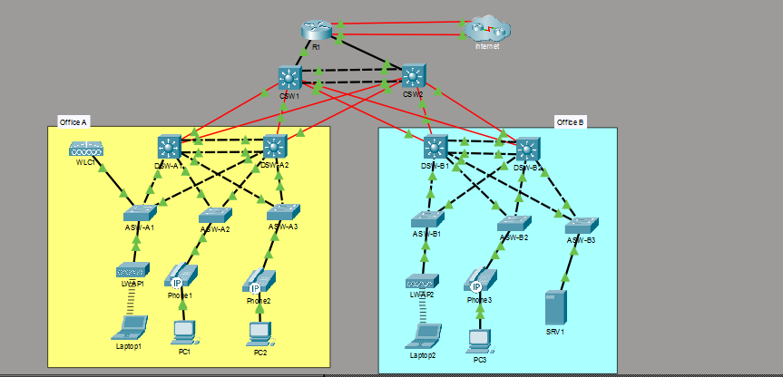
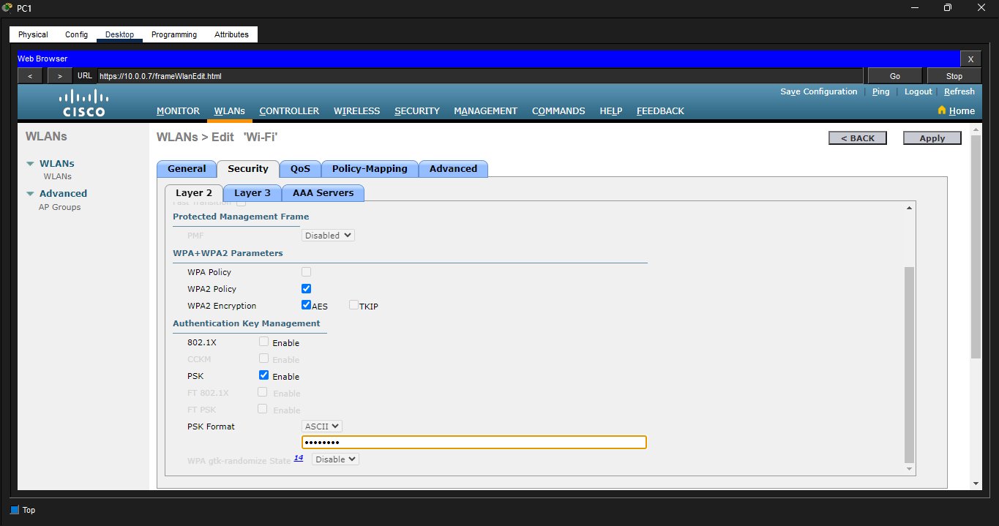
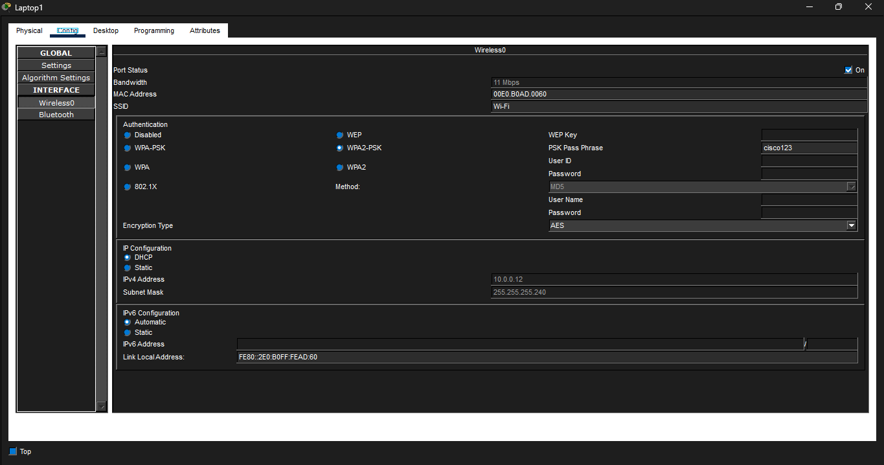
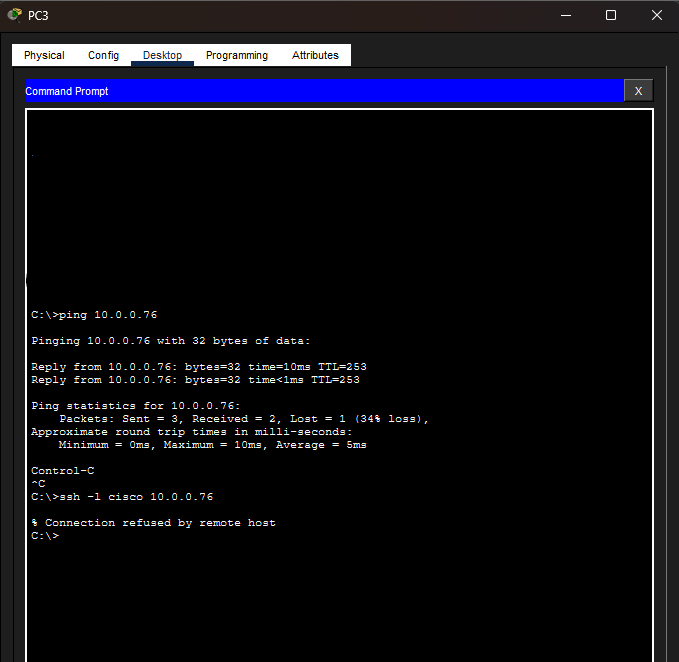
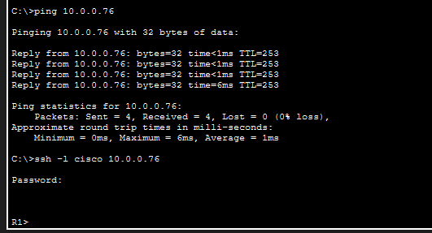
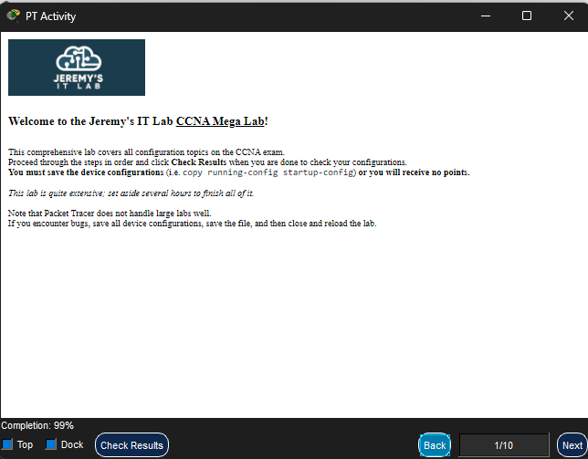

# 🌐 Enterprise Campus Network Architecture & Multi-Site Routing

### 📌 Project Overview
This project represents a full-scale, enterprise-grade campus network deployment built and verified in Cisco Packet Tracer. It validates core routing, switching, wireless, and security implementations, including **Multi-Area OSPF dynamic routing**, **Inter-VLAN routing**, **Switch Virtual Interfaces (SVIs)**, **Centralized Wireless LAN Controller (WLC) management**, and **Border Security (Extended ACLs, SSH, and NAT)**.

---

### 🏗️ Network Topology & Architecture

*Figure 1: Complete Enterprise Topology featuring Dual Distribution/Access Switches, Centralized WLC, Lightweight Access Points, Edge Routers, and WAN Infrastructure.*

---

### 🛠️ Key Technical Implementations

#### 1. Switching Infrastructure & Layer 2 Redundancy
* **VLAN Segmentation:** Mapped distinct VLANs across Office A and Office B for Corporate Data, IT Management, Voice, Guest, and Wireless AP traffic.
* **Link Aggregation & STP:** Provisioned LACP EtherChannels between distribution and access switches for high-bandwidth trunking while preventing Layer 2 switching loops via Spanning Tree Protocol.
* **Inter-VLAN Routing:** Configured SVIs on core/distribution layer switches (`DSW-A1`, `DSW-A2`, `DSW-B1`, `DSW-B2`) to handle internal multi-VLAN traffic routing at line rate.

#### 2. Dynamic Routing & WAN Architecture
* **Multi-Area OSPF:** Deployed OSPF across internal core routers (`R1`, `CSW1`, `CSW2`) and Layer 3 switches to establish dynamic route propagation and fast fault convergence.
* **Default Route Injection:** Configured edge router `R1` as the ASBR to propagate default routes out to external WAN endpoints.

#### 3. Enterprise Wireless Integration (WLC & APs)
* **Centralized WLAN Controller:** Configured `WLC1` to manage Lightweight APs (`LWAP1`, `LWAP2`) using CAPWAP tunnels.
* **Dynamic Interfaces & SSIDs:** Created dynamic wireless interfaces mapped to internal VLANs, secured via WPA2-Enterprise authentication.

#### 4. Infrastructure Security & Network Address Translation
* **Extended Access Control Lists:** Applied inbound boundary ACLs on core layer SVIs to restrict unauthorized traffic between remote campus VLANs.
* **Device Hardening:** Enforced SSHv2 management, AAA local authentication, and encrypted secrets across all network devices.
* **PAT / NAT Overload:** Configured Port Address Translation on `R1` to translate internal RFC 1918 private IP ranges for external public reachability.

#### 5. Automated Services
* **DHCP Pools:** Configured centralized DHCP pools for dynamic host addressing and default gateway configuration across corporate workstations.

---

### 📊 Lab Verification & Completion Score

> **Engineering Note on Simulator Behavior:**
> * **SVI ACL Display Constraint:** Cisco Packet Tracer has a known display behavior where binding an extended ACL to an SVI (`interface vlan 10`) processes packet filtering accurately in runtime, but may omit the `ip access-group` syntax from the `show running-config` output.
> * **WLC DHCP Relay Behavior:** Packet Tracer restricts dynamic DHCP broadcast relaying to wireless endpoints in large multi-layer switch topologies. WLC dynamic interfaces, CAPWAP bindings, and WLAN profiles were independently validated via WLC management GUI and CLI.

---

### 📂 Repository File Structure
* `*_run_config.txt`: Complete running configurations exported from all Core/Distribution/Access switches (`CSW`, `DSW`, `ASW`) and Edge Routers (`R1`).
* `*.PNG`: High-resolution proof-of-concept screenshots validating topology status, routing tables, ping reachability, SSH sessions, and WLC bindings.
